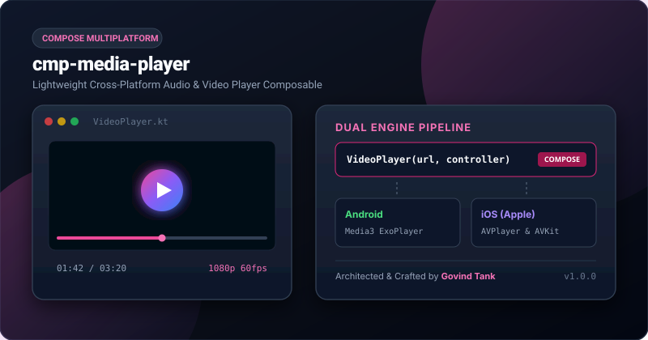

# cmp-media-player

<p align="center">
  <a href="https://jitpack.io/#govindtank/cmp-media-player"></a>
  <a href="https://github.com/govindtank/cmp-media-player/actions"></a>
  
  
  <a href="LICENSE"></a>
  <a href="https://github.com/govindtank"></a>
</p>

<p align="center">
  <b>Lightweight Cross-Platform Audio &amp; Video Player Composable for Compose Multiplatform.</b><br>
  <i>Architected &amp; Crafted with ❤️ by <a href="https://github.com/govindtank">Govind Tank</a></i>
</p>

<p align="center">
  
</p>

---

## ⚡ Why `cmp-media-player`?

Handling cross-platform video and audio streams in Compose Multiplatform is traditionally prone to native surface-destruction crashes, complex audio focus handling, and heavy bridging code:
- **Android**: Demands modern AndroidX Media3 (`ExoPlayer`, `PlayerView`, and `LifecycleOwner` detachment).
- **iOS**: Relies on Apple `AVFoundation` (`AVPlayer`, `AVPlayerViewController`, and `UIKitView` embedding).

`cmp-media-player` unifies video and audio streaming into **declarative Compose components**:
- 🎥 **`VideoPlayer` Composable**: Render MP4, HLS (.m3u8), DASH, WebM with custom aspect ratio scaling (`FIT`, `FILL`, etc.).
- 🎵 **`AudioPlayer` Composable**: Headless or UI-driven audio streaming with playback speed control and looping.
- 🎛️ **`MediaPlayerController`**: Programmatic playback controls (`play()`, `pause()`, `seekTo()`, `setSpeed()`, `setVolumeLevel()`).
- 📊 **Reactive State Tracking**: Real-time position tracking (`currentPositionMs`), duration (`durationMs`), and state lifecycle.

---

## 📦 Installation

Add JitPack and the dependency to your `build.gradle.kts`:

```kotlin
repositories {
    maven { url = uri("https://jitpack.io") }
}

dependencies {
    implementation("com.github.govindtank:cmp-media-player:1.0.0")
}
```

---

## 🚀 Quick Start

### 1. Playing Video in Compose

```kotlin
import androidx.compose.foundation.layout.*
import androidx.compose.runtime.*
import androidx.compose.ui.Modifier
import androidx.compose.ui.unit.dp
import io.github.govindtank.player.*

@Composable
fun VideoPlayerScreen() {
    val controller = rememberMediaPlayerController()

    Column(modifier = Modifier.fillMaxSize().padding(16.dp)) {
        VideoPlayer(
            url = "https://commondatastorage.googleapis.com/gtv-videos-bucket/sample/BigBuckBunny.mp4",
            modifier = Modifier
                .fillMaxWidth()
                .height(240.dp),
            config = PlayerConfig(
                autoPlay = true,
                loop = false,
                showControls = true,
                resizeMode = VideoResizeMode.FIT
            ),
            controller = controller,
            onStateChanged = { state ->
                println("Player State changed: $state")
            }
        )

        Spacer(Modifier.height(12.dp))

        // Position Indicator
        Text("Position: ${controller.currentPositionMs / 1000}s / ${controller.durationMs / 1000}s")

        Row(horizontalArrangement = Arrangement.spacedBy(8.dp)) {
            Button(onClick = { controller.togglePlayPause() }) {
                Text(if (controller.state == PlayerState.PLAYING) "Pause" else "Play")
            }
            Button(onClick = { controller.seekTo(0) }) {
                Text("Restart")
            }
        }
    }
}
```

### 2. Playing Audio in Compose

```kotlin
import androidx.compose.material3.*
import androidx.compose.runtime.*
import io.github.govindtank.player.*

@Composable
fun AudioStreamScreen() {
    val controller = rememberMediaPlayerController()

    AudioPlayer(
        url = "https://www.soundhelix.com/examples/mp3/SoundHelix-Song-1.mp3",
        config = PlayerConfig(autoPlay = false, loop = true),
        controller = controller
    )

    Button(onClick = { controller.togglePlayPause() }) {
        Text(if (controller.state == PlayerState.PLAYING) "Pause Audio" else "Play Audio")
    }
}
```

---

## 📱 Platform Engine Matrix

| Platform | Video Engine | Audio Engine | Formats |
| :--- | :--- | :--- | :--- |
| **Android** | AndroidX Media3 `ExoPlayer` + `PlayerView` | Media3 `ExoPlayer` | MP4, HLS (.m3u8), DASH, MP3, AAC, WebM |
| **iOS** | Apple `AVPlayer` + `AVPlayerViewController` | Apple `AVPlayer` | MP4, HLS, MOV, MP3, AAC, M4A |

---

## 💖 Support & Sponsorship

If you find this library useful in your Compose Multiplatform products, please consider sponsoring continuous development:

<p align="left">
  <a href="https://www.patreon.com/govindtank"></a>
  <a href="https://github.com/sponsors/govindtank"></a>
  <a href="https://buymeacoffee.com/govindtank"></a>
</p>

- **Patreon**: [patreon.com/govindtank](https://www.patreon.com/govindtank)
- **GitHub Sponsors**: [github.com/sponsors/govindtank](https://github.com/sponsors/govindtank)
- **Buy Me a Coffee**: [buymeacoffee.com/govindtank](https://buymeacoffee.com/govindtank)

Your sponsorship fuels new multiplatform libraries, performance enhancements, and maintenance!

---

## 👨💻 Author

**Govind Tank**
- **GitHub**: [@govindtank](https://github.com/govindtank)
- **Website**: [govindtank.github.io](https://govindtank.github.io)
- **LinkedIn**: [linkedin.com/in/govind-tank](https://linkedin.com/in/govind-tank)

---

## 📄 License

```
Copyright 2026 Govind Tank

Licensed under the Apache License, Version 2.0 (the "License");
you may not use this file except in compliance with the License.
You may obtain a copy of the License at

    http://www.apache.org/licenses/LICENSE-2.0
```
